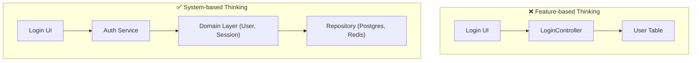
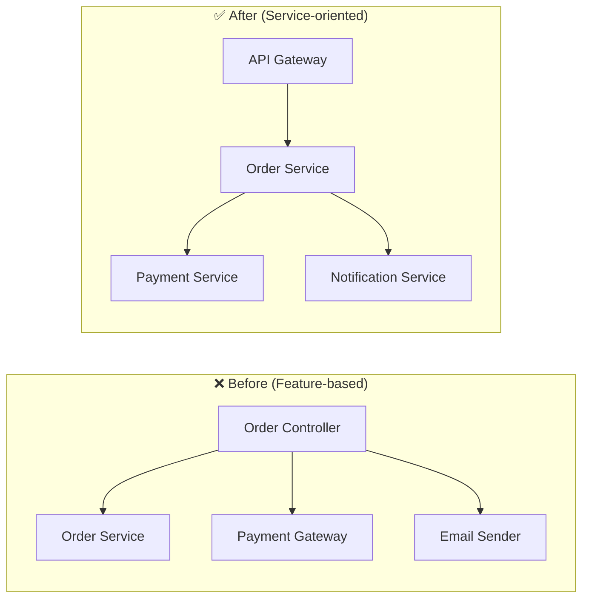
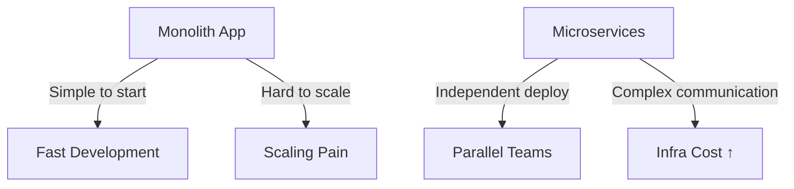

# Ep2 — The Hidden Gap Between Good Developers and Great Architects

> 🎯 *“A good developer makes things work. A great architect makes things last.”*

---

## 🧠 Why Some Great Developers Never Become Architects

You’ve probably met developers who write elegant, efficient, and clean code — yet when they’re asked to design a scalable system, they freeze.

It’s not because they lack talent.  
It’s because **the mindset that builds features is different from the mindset that builds systems**.

---

## 1. The Mindset Gap

### 🧩 Good Developer: “How do I make this feature work?”
They focus on delivering functionality that meets the current requirement.

### 🏗️ Great Architect: “How will this system evolve?”
They think in terms of relationships, flows, and boundaries — anticipating what might break, scale, or change.

> 💡 *Developers think in lines of code. Architects think in lines of communication.*

### 🧱 System Diagram: Feature-Driven vs System-Driven Thinking

> A developer connects components in a straight line: UI → API → DB.  
> An architect separates responsibilities: Presentation → Service → Domain → Repository → Infrastructure.  
> This separation makes the system **resilient to change** — adding new login methods like OAuth won’t break everything.

---

## 2. The Action Gap

### 🚀 Good Developer: Reactive
They execute what’s assigned — “Build a new order API,” “Fix this bug,” “Optimize that query.”

### 🧭 Great Architect: Proactive
They see the patterns forming before anyone else does.  
They think: *“This logic will repeat. Let’s refactor it into a service.”*

### ⚙️ Diagram: Refactoring from Controller Chaos to Clear Architecture

> A good developer sees a working function.  
> A great architect sees a **future bottleneck** — and turns that function into a **service**.

This small decision unlocks testability, scalability, and independent deployments.

---

## 3. The Learning Gap

Most developers study *frameworks*.  
Architects study *systems*.

| Level | Focus | Typical Question |
|-------|--------|------------------|
| Developer | Libraries, Syntax, Tools | “How do I use this?” |
| Architect | Boundaries, Trade-offs, Lifecycle | “What happens if this fails?” |

### 🧩 Diagram: The Trade-off Lens

> There’s no perfect architecture — only **trade-offs**.  
> A great architect doesn’t choose what’s trendy; they choose what fits.

---

## 4. The Transition Path: From Developer → Architect

Becoming an architect isn’t about a job title — it’s about **how you think, communicate, and design**.

Here’s a roadmap you can start today:

### 🔹 Step 1 — Think in Systems, Not Screens
Ask: *“What other parts will depend on this?”*  
Sketch data flow, dependencies, and interactions.

### 🔹 Step 2 — Learn to Communicate Through Diagrams
Use simple flowcharts or sequence diagrams.  
Architects are storytellers — their diagrams teach others how the system breathes.

### 🔹 Step 3 — Study Failures
Read real-world postmortems (Netflix, Uber, Amazon).  
Architects aren’t those who avoid failure — they **design for recovery**.

### 🔹 Step 4 — Build for the Next 6 Months, Not Just This Sprint
Ask yourself before merging any PR:  
> “Will this design survive future changes?”

If the answer is no — redesign, simplify, or document the trade-offs.

---

## 🧭 Final Thought

> 🌱 *Good developers write code that grows fast.*  
> *Great architects build systems that grow wisely.*

Your growth from developer to architect isn’t about years of experience — it’s about how you see, connect, and shape complexity.

So the next time you’re about to push new code, pause for a second —  
and ask yourself:  
**Am I just building a feature, or am I shaping a foundation?**

---

## 💬 What’s Next

🧩 **Ep3 — The Architecture Thinking Toolkit**  
> A hands-on guide to diagramming, evaluating trade-offs, and thinking like a system designer.
